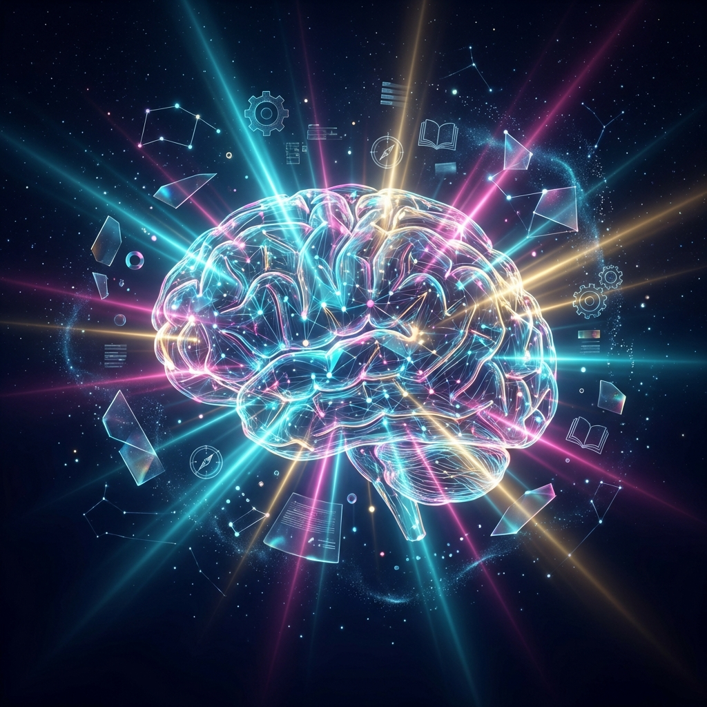
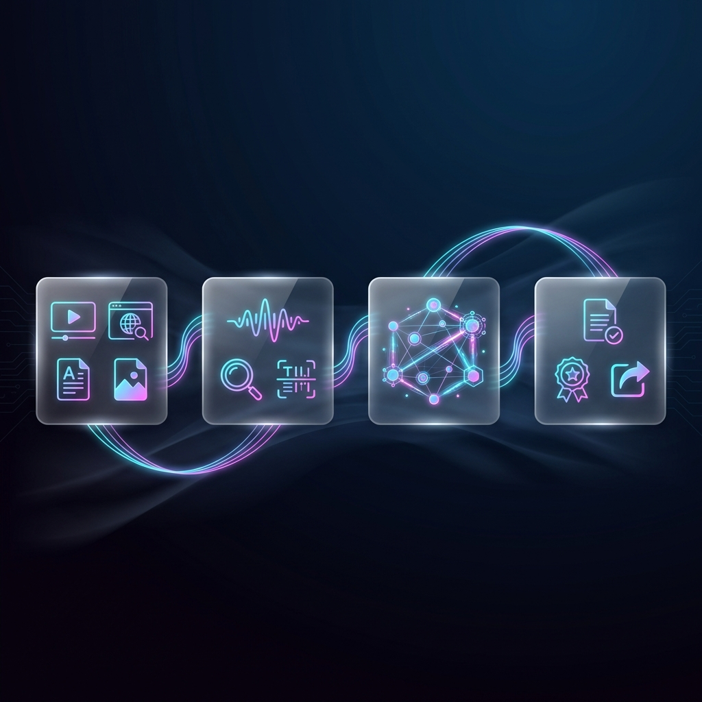
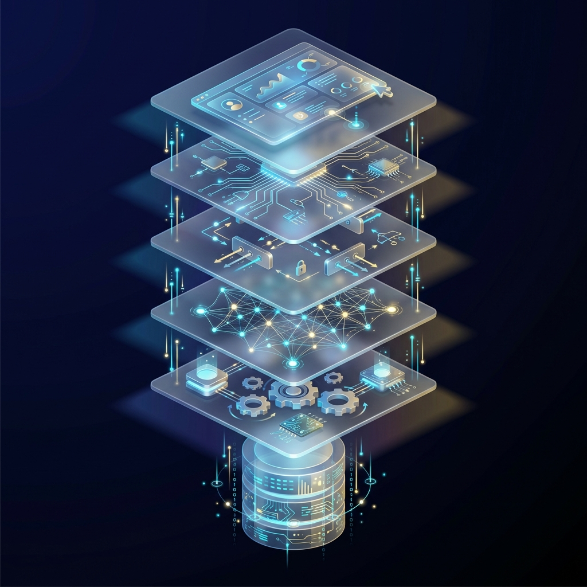
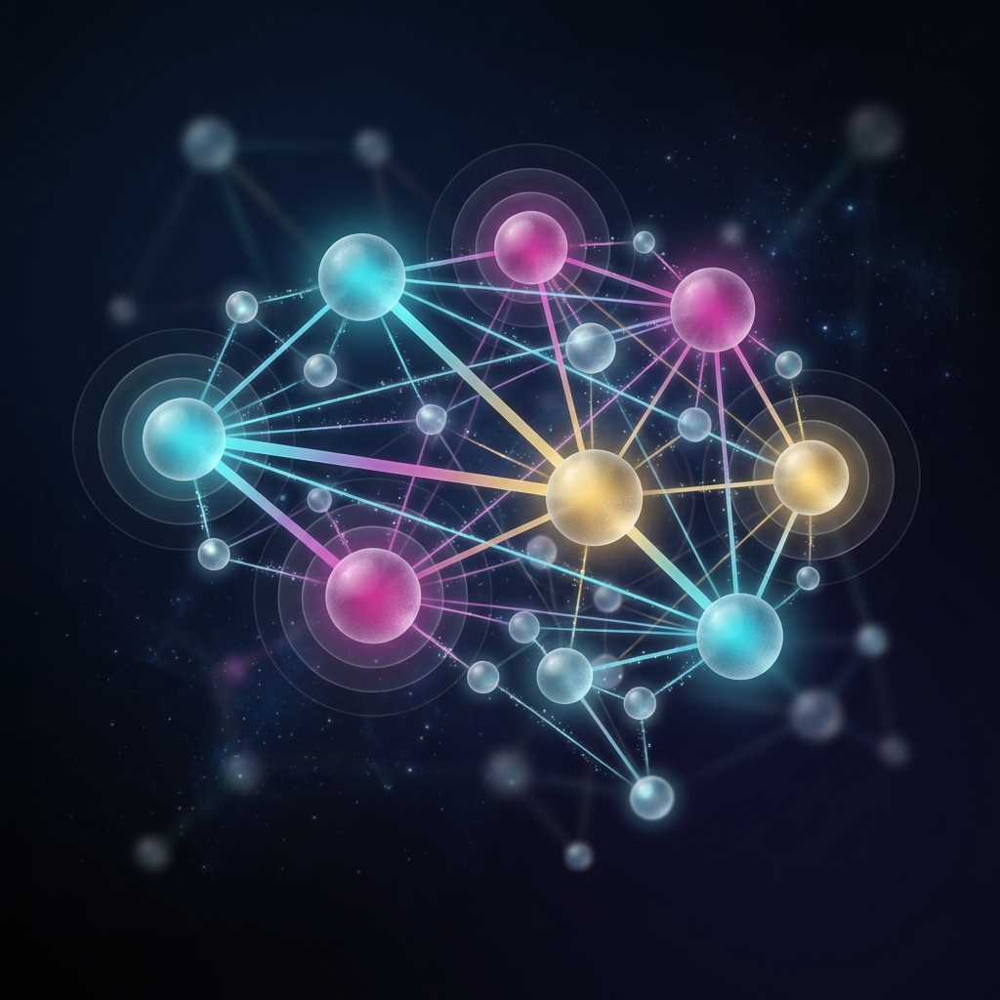
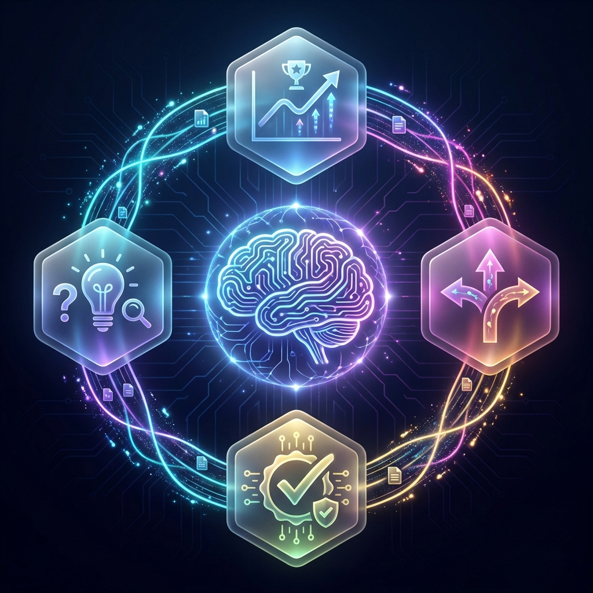

<div align="center">



# Inception

### *Recursive Knowledge Architecture*

**Transform scattered learning into interconnected understanding.**  
**Build knowledge that knows itself. Systems that heal themselves.**

[](https://python.org)
[](https://www.symas.com/lmdb)
[](tests/)
[](LICENSE)

[The Vision](#the-vision) · [How It Works](#how-it-works) · [Capabilities](#capabilities) · [Learning Engine](#the-learning-engine) · [Get Started](#quick-start)

</div>

---

## The Vision

You watch a technical video. Read three blog posts. Skim an RFC. A week later, you remember *something* about OAuth tokens expiring—but where did you learn that? Was it from the RFC or the blog? Did the blog contradict the spec?

**Knowledge scatters. Context evaporates. Contradictions hide.**

Inception solves this by building a **temporal knowledge hypergraph**: every claim anchored to its source with timestamps, every entity linked to authoritative ontologies, every gap identified for resolution.

Your learning materials become a living, queryable intelligence system—locally stored, privately owned, continuously improving.

---

## How It Works

<div align="center">



*Sources flow through extraction into a unified knowledge graph, producing actionable outputs.*

</div>

Inception ingests your learning materials—YouTube videos, web pages, PDFs, slide decks—and extracts structured knowledge through a four-stage pipeline:

| Stage | What Happens |
|-------|--------------|
| **Acquisition** | Download, transcribe, and segment multimodal sources |
| **Extraction** | Apply Whisper ASR, scene detection, OCR, and alignment |
| **Analysis** | Extract claims (SPO), entities (NER), procedures, and gaps |
| **Output** | Generate ActionPacks, Skills, exports, and queries |

---

## Architecture

<div align="center">



*Six-layer isometric architecture: from storage through learning to outputs.*

</div>

```
inception/
├── ingest/      → Source acquisition (YouTube, Web, PDF)
├── extract/     → Content extraction (ASR, OCR, scenes)
├── analyze/     → Semantic analysis (claims, entities, gaps)
├── enhance/     → Intelligence layer (LLM, vectors, learning)
├── db/          → LMDB hypergraph storage
├── serve/       → FastAPI REST + WebSocket API
└── output/      → ActionPacks, Skills, Obsidian export
```

**Enhancement Epic Complete:** 100 steps, 289 tests across 4 tiers:
- **Tier 1 Intelligence:** LLM Extractor, Vector Index, Vision VLM
- **Tier 2 Agency:** Gap Explorer, Fact Validator, Execution Engine
- **Tier 3 Synthesis:** Multi-Source Fusion, Ontology Linker, Temporal Reasoner
- **Tier 4 Operations:** Incremental Sync, Export Pipeline, Terminal UI

---

## Capabilities

### Knowledge Graph

<div align="center">



*Entities, claims, and relationships form an interconnected constellation of understanding.*

</div>

Every fact becomes a node. Every relationship becomes an edge. The result is a **temporal hypergraph** where:

- **Entities** are disambiguated and linked to Wikidata/DBpedia
- **Claims** are decomposed into subject-predicate-object (SPO) triples
- **Procedures** are synthesized into executable skill definitions
- **Gaps** are detected and queued for autonomous resolution

```python
Claim(
    text="OAuth 2.0 access tokens typically expire after one hour",
    subject="OAuth 2.0 access tokens",
    predicate="expire",
    object="after one hour",
    modality="assertion",
    hedges=["typically"],
    confidence=Confidence(aleatoric=0.92, epistemic=0.88),
)
```

---

### Temporal Reasoning

<div align="center">


*Facts have validity windows. The system understands when knowledge was true.*

</div>

Knowledge isn't static—it evolves. Inception implements **Allen's 13 interval relations** to understand temporal relationships:

| Relation | Meaning |
|----------|---------|
| **before** | Interval A ends before B starts |
| **meets** | A ends exactly when B starts |
| **overlaps** | A starts before B, they overlap |
| **during** | A is entirely contained within B |
| **equals** | A and B are the same interval |

Query what was true at any point in time:

```bash
curl "http://localhost:8000/api/entities/temporal?at=2010-06-15"
# Returns: OAuth 1.0 entities (2.0 didn't exist yet)
```

---

### Gap Resolution

<div align="center">


*Detected gaps trigger autonomous research with safety rails.*

</div>

When Inception encounters undefined terms or missing context, it doesn't just flag the gap—it can **autonomously research and resolve it**:

1. **Detection**: Identify undefined terms, missing prerequisites, or contradictions
2. **Classification**: Categorize gap type (definition, context, evidence, conflict)
3. **Research**: Search authoritative sources within safety constraints
4. **Resolution**: Ingest new sources and integrate knowledge

**Safety Rails:**
- Rate limiting and budget caps
- Domain allowlists for research
- Human-in-the-loop mode (default: on)
- Depth limits for recursive exploration

---

### Entity Linking

<div align="center">


*Entities connect to global knowledge bases for disambiguation and enrichment.*

</div>

Entity mentions are linked to external ontologies:

| Source | Purpose |
|--------|---------|
| **Wikidata** | Structured knowledge graph with QIDs |
| **DBpedia** | Wikipedia-derived structured data |
| **Schema.org** | Semantic type classification |

This enables:
- **Disambiguation**: "Apple" → Company vs. Fruit
- **Enrichment**: Pull related entities and properties
- **Consistency**: Canonical references across sources

---

## The Learning Engine

<div align="center">



*Four optimization strategies work together for continuous self-improvement.*

</div>

Inception doesn't just extract knowledge—it **learns to extract better**. The learning engine orchestrates multiple optimization strategies:

### Current Optimizers

| Optimizer | Purpose | Innovation |
|-----------|---------|------------|
| **DAPO** | High-variance exploration | Dynamic clip range based on advantage variance |
| **GRPO** | Preference ranking | Group-relative advantages without critic network |
| **RLVR** | Ground-truth verification | Verifiable reward signals from source matching |
| **GAP** | Uncertainty exploration | Prioritize actions that fill knowledge gaps |
| **Active** | Sample selection | Query most informative examples |

### Advanced Integrations (v2)

| Framework | Integration | Expected Improvement |
|-----------|-------------|---------------------|
| **DSPy** | Extraction prompt optimization | +10% claim F1 via MIPROv2 |
| **TextGrad** | Iterative claim refinement | +15% accuracy via textual backprop |
| **GRPO v2** | DeepSeek-style reasoning | Emergent self-verification |

---

## Multi-Source Fusion

When claims appear across multiple sources, Inception fuses them using **Bayesian uncertainty quantification**:

| Source | Claim | Authority | Freshness |
|--------|-------|-----------|-----------|
| RFC 6749 | "Tokens expire in 3600s" | 1.0 | 0.7 |
| Blog Post | "Tokens last about an hour" | 0.6 | 0.9 |
| Tutorial | "Access tokens: 1 hour TTL" | 0.7 | 0.8 |

**Fused Result:** `"Access tokens expire in 3600 seconds (1 hour)"` — **Confidence: 0.94**

Conflict resolution strategies: `recency`, `authority`, `consensus`, `confidence`

---

## Quick Start

```bash
# Clone and install
git clone https://github.com/krodotma/inception.git
cd inception && uv sync

# Verify environment
uv run inception doctor

# Ingest your first source
uv run inception ingest "https://youtube.com/watch?v=..."

# Query your knowledge
uv run inception query "What is PKCE?"

# Export to Obsidian
uv run inception export obsidian -o ~/Vault/Inception

# Generate skills from procedures
uv run inception skillify --all
```

### OAuth Authentication (Keyless LLM Access)

```bash
inception auth setup claude   # Browser OAuth flow
inception auth setup gemini   # Google OAuth flow
inception auth status         # View connected providers
```

---

## API Reference

Start the server:

```bash
uv run inception serve --port 8000
```

### Core Endpoints

| Method | Endpoint | Description |
|--------|----------|-------------|
| `GET` | `/api/stats` | Database statistics |
| `GET` | `/api/entities` | List all entities |
| `GET` | `/api/claims` | List all claims |
| `GET` | `/api/procedures` | List all procedures |
| `GET` | `/api/gaps` | List detected gaps |
| `GET` | `/api/sources` | List ingested sources |

### Knowledge Operations

| Method | Endpoint | Description |
|--------|----------|-------------|
| `POST` | `/api/ingest` | Ingest a source URL |
| `POST` | `/api/query` | Natural language query |
| `POST` | `/api/graph/path` | Find path between nodes |
| `GET` | `/api/entities/temporal` | Query at specific time |

### Learning Engine

| Method | Endpoint | Description |
|--------|----------|-------------|
| `POST` | `/api/learning/step` | Execute learning step |
| `POST` | `/api/learning/train` | Train on experiences |
| `GET` | `/api/learning/stats` | Optimizer statistics |

---

## RheoMode Output Levels

Control the resolution of generated outputs:

| Level | Name | What You Get |
|-------|------|--------------|
| 0 | **Gist** | One-line summary |
| 1 | **Takeaways** | Key points + action items |
| 2 | **Evidence** | Claims linked to sources |
| 3 | **Full** | Complete knowledge deconstruction |
| 4 | **Skills** | Executable skill definitions |

```bash
uv run inception action-pack "OAuth Security" --rheomode 2
```

---

## Testing

```bash
# Full suite
uv run pytest

# By category
uv run pytest tests/unit
uv run pytest tests/integration  
uv run pytest tests/e2e

# With coverage
uv run pytest --cov=inception --cov-report=term-missing
```

---

## Dependencies

| Category | Packages |
|----------|----------|
| **Core** | Python 3.11+, lmdb, click, pydantic, rich |
| **Media** | yt-dlp, faster-whisper, pyscenedetect, opencv-python |
| **NLP** | spacy, trafilatura |
| **Documents** | pdfplumber, python-pptx, python-docx |
| **Vectors** | sentence-transformers, chromadb |
| **Learning** | dspy-ai, textgrad (optional) |

---

<div align="center">

---

*Knowledge that compounds. Systems that learn. Intelligence that heals itself.*

**[GitHub](https://github.com/krodotma/inception)** · **[Documentation](docs/)** · **[API Reference](docs/API.md)**

---

</div>
