<div align="center">


# Inception

**Local-First Knowledge Compiler for Multimodal Sources**

*Transform scattered learning materials into an interconnected knowledge hypergraph—locally, privately, intelligently.*

[](https://python.org)
[](https://www.symas.com/lmdb)
[](tests/)
[](LICENSE)

[Capabilities](#capabilities) · [Architecture](#architecture) · [Learning Engine](#the-learning-engine) · [Quick Start](#quick-start) · [API Reference](#api-reference)

</div>

---

## The Problem

You watch a technical video. Read three blog posts. Skim an RFC. A week later, you remember *something* about OAuth tokens expiring—but where did you learn that? Was it from the RFC or the blog? Did the blog contradict the spec?

Knowledge scatters. Context evaporates. Contradictions hide.

## The Solution

Inception ingests your learning materials—YouTube videos, web pages, PDFs, slide decks—and extracts a **temporal knowledge hypergraph**: entities, claims, procedures, and detected gaps, all anchored to their sources with timestamps and confidence scores.

```mermaid
flowchart LR
    subgraph Sources["📥 Sources"]
        YT[YouTube]
        WEB[Web Pages]
        PDF[Documents]
        IMG[Images]
    end
    
    subgraph Extraction["🔍 Extraction"]
        ASR[Whisper ASR]
        OCR[PaddleOCR]
        VLM[Vision LLM]
        NLP[spaCy NER]
    end
    
    subgraph Knowledge["🧠 Knowledge Graph"]
        E[Entities]
        C[Claims]
        P[Procedures]
        G[Gaps]
    end
    
    subgraph Output["📤 Outputs"]
        AP[ActionPacks]
        SK[Skills]
        OB[Obsidian]
    end
    
    Sources --> Extraction --> Knowledge --> Output
```



---

## Capabilities

### 🎯 Claim Extraction with SPO Decomposition

Every factual statement becomes a structured claim with subject-predicate-object decomposition, modality tracking, and hedge detection:

```python
Claim(
    text="OAuth 2.0 access tokens typically expire after one hour",
    subject="OAuth 2.0 access tokens",
    predicate="expire",
    object="after one hour",
    modality="assertion",
    hedges=["typically"],
    confidence=Confidence(aleatoric=0.92, epistemic=0.88),
    source_span_nid=42,  # Linked to exact timestamp
)
```

### 🔗 Entity Linking to External Ontologies

Entities are disambiguated and linked to Wikidata and DBpedia:


### ⏱️ Allen Temporal Reasoning

Facts have validity windows. The system understands temporal relationships using Allen's 13 interval relations:


Query what was true at any point in time:

```bash
curl "http://localhost:8000/api/entities/temporal?at=2010-06-15"
# Returns: OAuth 1.0 entities (2.0 didn't exist yet)
```

### 🔀 Multi-Source Bayesian Fusion

When claims appear in multiple sources, Inception fuses them with Bayesian uncertainty quantification:

| Source | Claim | Authority | Freshness |
|--------|-------|-----------|-----------|
| RFC 6749 | "Tokens expire in 3600s" | 1.0 | 0.7 |
| Blog Post | "Tokens last about an hour" | 0.6 | 0.9 |
| Tutorial | "Access tokens: 1 hour TTL" | 0.7 | 0.8 |

**Fused Result:** `"Access tokens expire in 3600 seconds (1 hour)"` — Confidence: **0.94**

Conflict resolution strategies: `recency`, `authority`, `consensus`, `confidence`

### 🔍 Autonomous Gap Resolution

When Inception detects undefined terms or missing context, it can autonomously research and fill the gap:


**Safety rails:** Rate limiting, budget caps, domain allowlists, human-in-the-loop mode (default: on)

### 📜 Procedure → Executable Skill Synthesis

Extracted procedures become executable SKILL.md files:

```yaml
---
name: Deploy OAuth Server
tags: [devops, security]
difficulty: hard
estimated_time: 2h
---

## Prerequisites
- Docker installed
- Domain with SSL configured

## Steps

### Step 1: Generate RSA Key Pair
Generate a 2048-bit RSA key for JWT signing.

### Step 2: Configure JWKS Endpoint
Expose the public key via /.well-known/jwks.json

### Step 3: Initialize Token Service
...
```

---

## The Learning Engine

Inception continuously improves its extraction quality through a multi-strategy learning system:


### Current Optimizers

| Optimizer | Purpose | Key Innovation |
|-----------|---------|----------------|
| **DAPO** | High-variance exploration | Dynamic clip range based on advantage variance |
| **GRPO** | Preference ranking | Group-relative advantages without critic network |
| **RLVR** | Ground-truth verification | Verifiable reward signals from source matching |
| **GAP** | Uncertainty exploration | Prioritize actions that fill knowledge gaps |
| **Active** | Sample selection | Query most informative samples |

### Planned Integrations

| Framework | Integration Point | Expected Improvement |
|-----------|-------------------|---------------------|
| [DSPy](https://dspy.ai/) | Extraction prompt optimization | +10% claim F1 via MIPROv2 |
| [TextGrad](https://textgrad.com/) | Iterative claim refinement | +15% accuracy via textual backprop |
| GRPO v2 | DeepSeek-style reasoning | Emergent self-verification |

---

## Architecture


### Enhancement Epic: 100 Steps Complete

| Tier | Components | Tests |
|------|------------|-------|
| **Tier 1: Intelligence** | LLM Extractor, Vector Index, Vision VLM | 80 |
| **Tier 2: Agency** | Gap Explorer, Fact Validator, Execution Engine | 68 |
| **Tier 3: Synthesis** | Multi-Source Fusion, Ontology Linker, Temporal Reasoner | 86 |
| **Tier 4: Operations** | Incremental Sync, Export Pipeline, TUI | 55 |

**Total: 289 tests passing**

### Database Schema


**Node Types:** `ENTITY` | `CLAIM` | `PROCEDURE` | `GAP`

**Edge Types:** `MENTIONS` | `SUPPORTS` | `CONTRADICTS` | `RELATED_TO`

---

## Quick Start

```bash
# Install
git clone https://github.com/krodotma/inception.git
cd inception && uv sync

# Verify environment
uv run inception doctor

# Ingest a YouTube video
uv run inception ingest "https://youtube.com/watch?v=..."

# Query your knowledge
uv run inception query "What is PKCE?"

# Export to Obsidian
uv run inception export obsidian -o ~/Vault/Inception

# Generate skills from procedures
uv run inception skillify --all
```

### OAuth Authentication (Keyless LLM Access)

```bash
inception auth setup claude   # Browser OAuth flow
inception auth setup gemini   # Google OAuth flow
inception auth status         # View connected providers
```

---

## API Reference

Start the server:

```bash
uv run inception serve --port 8000
```

### Core Endpoints

| Method | Endpoint | Description |
|--------|----------|-------------|
| `GET` | `/api/stats` | Database statistics |
| `GET` | `/api/entities` | List all entities |
| `GET` | `/api/claims` | List all claims |
| `GET` | `/api/procedures` | List all procedures |
| `GET` | `/api/gaps` | List detected gaps |
| `GET` | `/api/sources` | List ingested sources |

### Knowledge Operations

| Method | Endpoint | Description |
|--------|----------|-------------|
| `POST` | `/api/ingest` | Ingest a source |
| `POST` | `/api/query` | Natural language query |
| `POST` | `/api/graph/path` | Find path between nodes |
| `GET` | `/api/entities/temporal?at=` | Query at specific time |

### Learning Engine

| Method | Endpoint | Description |
|--------|----------|-------------|
| `POST` | `/api/learning/step` | Execute learning step |
| `POST` | `/api/learning/train` | Train on experiences |
| `GET` | `/api/learning/stats` | Optimizer statistics |
| `POST` | `/api/learning/gap/select` | GAP policy selection |

---

## RheoMode Output Levels

Control the resolution of generated outputs:

| Level | Name | What You Get |
|-------|------|--------------|
| 0 | **Gist** | One-line summary |
| 1 | **Takeaways** | Key points + action items |
| 2 | **Evidence** | Claims linked to sources |
| 3 | **Full** | Complete knowledge deconstruction |
| 4 | **Skills** | Executable skill definitions |

```bash
uv run inception action-pack "OAuth Security" --rheomode 2
```

---

## Testing

```bash
# Full suite
uv run pytest

# By category
uv run pytest tests/unit
uv run pytest tests/integration  
uv run pytest tests/e2e

# With coverage
uv run pytest --cov=inception --cov-report=term-missing
```

---

## Dependencies

| Category | Packages |
|----------|----------|
| **Core** | Python 3.11+, lmdb, click, pydantic, rich |
| **Media** | yt-dlp, faster-whisper, pyscenedetect, opencv-python |
| **NLP** | spacy, trafilatura |
| **Documents** | pdfplumber, python-pptx, python-docx |
| **Vectors** | sentence-transformers, chromadb |
| **Learning** | (planned) dspy-ai, textgrad |

---

<div align="center">

*Knowledge that compounds. Systems that learn. Intelligence that heals itself.*

**[GitHub](https://github.com/krodotma/inception)** · **[Documentation](docs/)** · **[API Reference](docs/API.md)**

</div>
