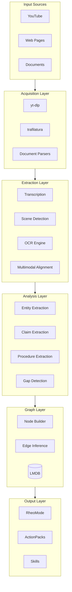

# Inception Architecture

## Overview

Inception is a local-first multimodal learning ingestion system that transforms learning materials (videos, web pages, documents) into a temporal knowledge hypergraph with actionable outputs.



## Layer Architecture

### 1. Acquisition Layer (`inception/ingest/`)

Handles source ingestion from various formats:

| Module | Purpose | Dependencies |
|--------|---------|--------------|
| `youtube.py` | YouTube video/channel/playlist | yt-dlp |
| `web.py` | Web page extraction | trafilatura |
| `documents.py` | PDF/PPTX/DOCX/XLSX | pdfplumber, python-pptx |
| `source_manager.py` | Source tracking & watermarking | - |

**Key Classes:**
- `VideoMetadata`, `DownloadResult` - YouTube data
- `WebPageContent` - Web extraction
- `DocumentInfo` - Document metadata
- `SourceManager` - Ingestion orchestration

### 2. Extraction Layer (`inception/extract/`)

Extracts structured content from raw media:

| Module | Purpose | Dependencies |
|--------|---------|--------------|
| `transcription.py` | Audio transcription | faster-whisper |
| `scenes.py` | Scene detection & keyframes | PySceneDetect, OpenCV |
| `ocr.py` | Text recognition | PaddleOCR, Tesseract |
| `alignment.py` | Multimodal alignment | - |

**Key Classes:**
- `Transcriber`, `TranscriptResult` - ASR
- `SceneDetector`, `Scene`, `Keyframe` - Video analysis
- `OCREngine`, `OCRResult` - Text recognition
- `MultimodalAligner`, `AlignedSpan` - Temporal fusion

### 3. Analysis Layer (`inception/analyze/`)

Semantic analysis and knowledge extraction:

| Module | Purpose | Dependencies |
|--------|---------|--------------|
| `entities.py` | Named Entity Recognition | spaCy |
| `claims.py` | Claim extraction with SPO | spaCy |
| `procedures.py` | Step-by-step instructions | spaCy |
| `gaps.py` | Uncertainty detection | - |

**Key Classes:**
- `Entity`, `EntityCluster`, `EntityExtractionResult`
- `Claim`, `ClaimExtractionResult`
- `Procedure`, `ProcedureStep`, `ProcedureExtractionResult`
- `Gap`, `GapType`, `GapDetectionResult`

### 4. Graph Layer (`inception/graph/`)

Knowledge hypergraph construction:

| Module | Purpose |
|--------|---------|
| `builder.py` | Graph construction from semantics |

**Key Classes:**
- `GraphBuilder` - Creates nodes and edges
- `GraphBuildResult` - Statistics and references

**Node Types (NodeKind):**
- `ENTITY` - Named entities
- `CLAIM` - Factual claims
- `PROCEDURE` - Step-by-step instructions
- `GAP` - Uncertainties

**Edge Types (EdgeType):**
- `MENTIONS` - Entity mentions
- `SUPPORTS` - Evidence support
- `CONTRADICTS` - Conflicting claims
- `RELATED_TO` - Semantic similarity

### 5. Query Layer (`inception/query/`)

Search and retrieval:

| Module | Purpose |
|--------|---------|
| `engine.py` | Query execution |

**Query Types:**
- Temporal queries (time range)
- Entity search (type, name pattern)
- Claim search (modality, subject)
- Full-text search
- Graph traversal (neighbors, evidence chains)

### 6. Output Layer (`inception/output/`)

Multi-resolution output generation:

| Module | Purpose |
|--------|---------|
| `rheomode.py` | ActionPack generation |

**RheoMode Levels:**
| Level | Content |
|-------|---------|
| 0 - GIST | 1-line summary |
| 1 - TAKEAWAYS | Key points + actions |
| 2 - EVIDENCE | Evidence-linked claims |
| 3 - FULL | Complete deconstruction |
| 4 - SKILLS | Derived skills |

### 7. Skills Layer (`inception/skills/`)

Skill synthesis from procedures:

| Module | Purpose |
|--------|---------|
| `synthesizer.py` | Procedure→Skill conversion |

**Key Classes:**
- `Skill`, `SkillStep` - Skill definitions
- `SkillSynthesizer` - Synthesis engine

## Database Schema (LMDB)

The system uses LMDB with 9 sub-databases:

```
┌─────────────────────────────────────────────────────────────┐
│                        LMDB Environment                      │
├─────────────┬─────────────┬─────────────┬─────────────────────┤
│    meta     │   sources   │  artifacts  │       spans        │
│ (counters)  │ (SourceRec) │ (ArtifactRec│   (SpanRecord)     │
├─────────────┼─────────────┼─────────────┼─────────────────────┤
│    nodes    │    edges    │   gt2nid    │      tindex        │
│ (NodeRecord)│ (EdgeRecord)│  (graphtag  │  (temporal idx)    │
│             │             │   → NID)    │                     │
├─────────────┴─────────────┴─────────────┴─────────────────────┤
│                          pindex                               │
│                       (page index)                            │
└─────────────────────────────────────────────────────────────┘
```

### Key Encoding

All keys use big-endian 8-byte encoding for proper LMDB ordering:

```python
# NID key: 8 bytes
nid_key = struct.pack(">Q", nid)

# Temporal key: 8 + 8 bytes (source_nid + timestamp_ms)
temporal_key = struct.pack(">Qq", source_nid, timestamp_ms)

# Page key: 8 + 4 + 4 bytes (source_nid + page + y_position)
page_key = struct.pack(">QII", source_nid, page, y_pos)
```

### Record Schemas

All records use Pydantic models with MessagePack serialization:

```python
class SourceRecord(BaseModel):
    nid: int
    source_type: SourceType
    uri: str
    title: str | None
    status: SourceStatus
    # ... metadata fields

class SpanRecord(BaseModel):
    nid: int
    source_nid: int
    start_ms: int | None
    end_ms: int | None
    text: str | None
    # ... anchor fields

class NodeRecord(BaseModel):
    nid: int
    kind: NodeKind
    payload: dict[str, Any]
    evidence_spans: list[int]
    confidence: Confidence
    # ... verification fields

class EdgeRecord(BaseModel):
    nid: int
    edge_type: EdgeType
    from_nid: int
    to_nid: int
    weight: float
```

## Uncertainty Tracking

The system tracks two types of uncertainty:

### Aleatoric (Intrinsic)
- Inaudible audio
- OCR quality issues
- Ambiguous references

### Epistemic (Knowledge)
- Undefined terms
- Missing context
- Contradictions

Gap nodes capture these with:
- `gap_type` - Classification
- `severity` - minor/major/critical
- `context_text` - Surrounding content
- `resolved` - Whether addressed

## Configuration

Hierarchical configuration with YAML + environment override:

```yaml
# ~/.inception/config.yaml
data_dir: ~/.inception
lmdb:
  path: ~/.inception/db
  map_size: 10737418240
whisper:
  model_size: base
ocr:
  engine: paddleocr
pipeline:
  offline_mode: false
```

## CLI Architecture

Click-based CLI with nested commands:

```
inception
├── doctor          # Environment check
├── ingest          # Single source
├── ingest-channel  # YouTube channel
├── ingest-batch    # JSONL batch
├── build-graph     # Graph construction
├── query           # Search
├── action-pack     # Output generation
├── skillify        # Skill synthesis
├── list-sources    # List sources
├── stats           # Database stats
├── export          # Data export
└── test            # Run tests
```

## Dependencies

### Core
- Python 3.11+
- LMDB - Embedded database
- Click - CLI framework
- Pydantic - Data validation
- Rich - Terminal UI

### Media Processing
- yt-dlp - YouTube downloads
- faster-whisper - ASR
- PySceneDetect - Scene detection
- OpenCV - Video processing
- PaddleOCR - Text recognition

### NLP
- spaCy - NER, parsing
- trafilatura - Web extraction

### Documents
- pdfplumber - PDF extraction
- python-pptx - PowerPoint
- python-docx - Word
- openpyxl - Excel
